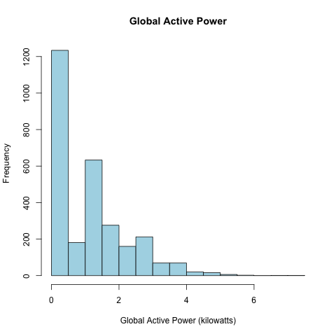
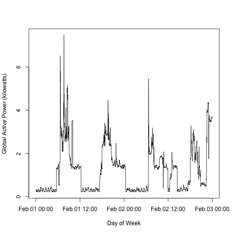
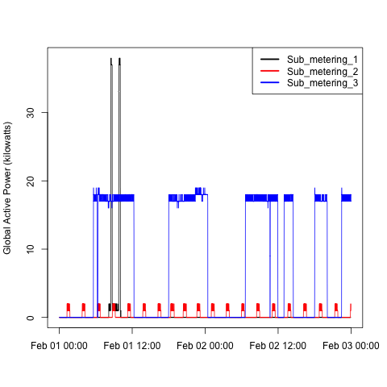
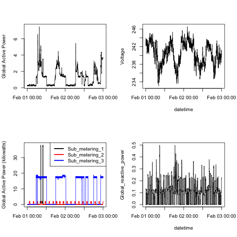

## Introduction

tasks: 

1. The dataset has 2,075,259 rows and 9 columns. **First calculate a rough estimate of how much memory the dataset will require** in memory before reading into R. 

To calculate a rough estimate of the amount of memory a data set will require in R, we can use the formula:

```
Memory Size = Number of Columns * Number of Rows * Size of Data Type
```

Roughly that is:  Memory Size = 9 columns * 2,075,259 rows * 8 bytes = 149,000,000 bytes = 149 MB 


2. You may find it useful to convert the Date and Time variables to Date/Time classes in R using the  strptime() and as.Date()

```R
data$Date <- as.Date(data$Date, format = "%d/%m/%Y")
data$Time <- strptime(data$Time, format = "%H:%M:%S")
data$Time <- format(data$Time, format = "%H:%M:%S")
```


3. We will only be using data from the dates 2007-02-01 and 2007-02-02.

```R
data <- subset(data, Date == as.Date("2007-02-01") | Date == as.Date("2007-02-02"))

```
4. exports the clean data set to the file clean.csv

```R
write.csv(data, "clean.csv", row.names = FALSE)
```

## Results

The results are shown in the following figures: (check the code in the plot*.R files)

### Plot 1
```R
# load the data into the memory
data <- read.csv("clean.csv")
# construct the png file device
png(filename = "plot1.png", width = 480, height = 480)
# create the plot
hist(data$Global_active_power, main="Global Active Power", xlab="Global Active Power (kilowatts)", ylab="Frequency", col="lightblue", border="black")
# close the graphics device
dev.off()
```


### Plot 2
```R
# load the data into the memory
data <- read.csv("clean.csv")
data$DateTime <- paste(data$Date, data$Time)
data$DateTime <- as.POSIXct(data$DateTime, format = "%Y-%m-%d %H:%M:%S") # correct the date format here
# construct the png file device
png(filename = "plot2.png", width = 480, height = 480)
# create the plot
plot(data$DateTime, data$Global_active_power, type = "l", xlab = "", ylab = "Global Active Power (kilowatts)")
# close the graphics device
dev.off()
```


### Plot 3
```R
# load the data into the memory
data <- read.csv("clean.csv")
data$DateTime <- paste(data$Date, data$Time)
data$DateTime <- as.POSIXct(data$DateTime, format = "%Y-%m-%d %H:%M:%S") # correct the date format here
# construct the png file device
png(filename = "plot3.png", width = 480, height = 480)
# create the plot
plot(data$DateTime, data$Sub_metering_1, type = "l", xlab = "", ylab = "Global Active Power (kilowatts)",col = "black")
lines(data$DateTime, data$Sub_metering_2, type = "l", xlab = "", ylab = "Global Active Power (kilowatts)", col = "red")
lines(data$DateTime, data$Sub_metering_3, type = "l", xlab = "", ylab = "Global Active Power (kilowatts)", col = "blue")
legend("topright", c("Sub_metering_1", "Sub_metering_2", "Sub_metering_3"), lty=1, lwd=2.5, col=c("black", "red", "blue"))
# close the graphics device
dev.off()
```


### Plot 4
```R
# load the data into the memory
data <- read.csv("clean.csv")
data$DateTime <- paste(data$Date, data$Time)
data$DateTime <- as.POSIXct(data$DateTime, format = "%Y-%m-%d %H:%M:%S") # correct the date format here
# construct the png file device
png(filename = "plot4.png", width = 480, height = 480)
# we need 2x2 plots
par(mfrow=c(2,2))
# create the plot
# first plot
plot(data$DateTime, data$Global_active_power, type = "l", xlab = "", ylab = "Global Active Power")
# second plot
plot(data$DateTime, data$Voltage, type = "l", xlab = "datetime", ylab = "Voltage")
# third plot
plot(data$DateTime, data$Sub_metering_1, type = "l", xlab = "", ylab = "Global Active Power (kilowatts)",col = "black")
lines(data$DateTime, data$Sub_metering_2, type = "l", xlab = "", ylab = "Global Active Power (kilowatts)", col = "red")
lines(data$DateTime, data$Sub_metering_3, type = "l", xlab = "", ylab = "Global Active Power (kilowatts)", col = "blue")
legend("topright", c("Sub_metering_1", "Sub_metering_2", "Sub_metering_3"), lty=1, lwd=2.5, col=c("black", "red", "blue"))
# fourth plot
plot(data$DateTime, data$Global_reactive_power, type = "l", xlab = "datetime", ylab = "Global_reactive_power")
# close the graphics device
dev.off()
```


## Implementation 

The code is implemented in the following files:

* clean.R - reads and cleans the raw data set, and exports the clean data set to the file clean.csv
* plot1.R - creates the first plot 
* plot2.R - creates the second plot
* plot3.R - creates the third plot
* plot4.R - creates the fourth plot

Notice: each of the plot*.R files reads the clean data set from the file clean.csv.


## Data Intro
This assignment uses data from
the <a href="http://archive.ics.uci.edu/ml/">UC Irvine Machine
Learning Repository</a>, a popular repository for machine learning
datasets. In particular, we will be using the "Individual household
electric power consumption Data Set" which I have made available on
the course web site:


* <b>Dataset</b>: <a href="https://d396qusza40orc.cloudfront.net/exdata%2Fdata%2Fhousehold_power_consumption.zip">Electric power consumption</a> [20Mb]

* <b>Description</b>: Measurements of electric power consumption in
one household with a one-minute sampling rate over a period of almost
4 years. Different electrical quantities and some sub-metering values
are available.


The following descriptions of the 9 variables in the dataset are taken
from
the <a href="https://archive.ics.uci.edu/ml/datasets/Individual+household+electric+power+consumption">UCI
web site</a>:

<ol>
<li><b>Date</b>: Date in format dd/mm/yyyy </li>
<li><b>Time</b>: time in format hh:mm:ss </li>
<li><b>Global_active_power</b>: household global minute-averaged active power (in kilowatt) </li>
<li><b>Global_reactive_power</b>: household global minute-averaged reactive power (in kilowatt) </li>
<li><b>Voltage</b>: minute-averaged voltage (in volt) </li>
<li><b>Global_intensity</b>: household global minute-averaged current intensity (in ampere) </li>
<li><b>Sub_metering_1</b>: energy sub-metering No. 1 (in watt-hour of active energy). It corresponds to the kitchen, containing mainly a dishwasher, an oven and a microwave (hot plates are not electric but gas powered). </li>
<li><b>Sub_metering_2</b>: energy sub-metering No. 2 (in watt-hour of active energy). It corresponds to the laundry room, containing a washing-machine, a tumble-drier, a refrigerator and a light. </li>
<li><b>Sub_metering_3</b>: energy sub-metering No. 3 (in watt-hour of active energy). It corresponds to an electric water-heater and an air-conditioner.</li>
</ol>

## Loading the data


When loading the dataset into R, please consider the following:

* The dataset has 2,075,259 rows and 9 columns. First
calculate a rough estimate of how much memory the dataset will require
in memory before reading into R. Make sure your computer has enough
memory (most modern computers should be fine).

* We will only be using data from the dates 2007-02-01 and
2007-02-02. One alternative is to read the data from just those dates
rather than reading in the entire dataset and subsetting to those
dates.

* You may find it useful to convert the Date and Time variables to
Date/Time classes in R using the `strptime()` and `as.Date()`
functions.

* Note that in this dataset missing values are coded as `?`.


## Making Plots

Our overall goal here is simply to examine how household energy usage
varies over a 2-day period in February, 2007. Your task is to
reconstruct the following plots below, all of which were constructed
using the base plotting system.

First you will need to fork and clone the following GitHub repository:
[https://github.com/rdpeng/ExData_Plotting1](https://github.com/rdpeng/ExData_Plotting1)


For each plot you should

* Construct the plot and save it to a PNG file with a width of 480
pixels and a height of 480 pixels.

* Name each of the plot files as `plot1.png`, `plot2.png`, etc.

* Create a separate R code file (`plot1.R`, `plot2.R`, etc.) that
constructs the corresponding plot, i.e. code in `plot1.R` constructs
the `plot1.png` plot. Your code file **should include code for reading
the data** so that the plot can be fully reproduced. You should also
include the code that creates the PNG file.

* Add the PNG file and R code file to your git repository

When you are finished with the assignment, push your git repository to
GitHub so that the GitHub version of your repository is up to
date. There should be four PNG files and four R code files.


The four plots that you will need to construct are shown below. 


### Plot 1


 


### Plot 2

 


### Plot 3

 


### Plot 4

 

